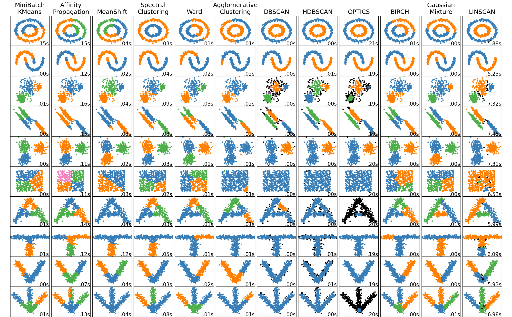

# LINSCAN

Implementation of the LINSCAN algorithm described in [Dennehy, Andrew et al. (2024)](https://www.researchgate.net/publication/381736748_LINSCAN_--_A_Linearity_Based_Clustering_Algorithm). LINSCAN s a clustering algorithm specialised for the detection of highly linear clusters.

## Installation
Git clone this repository then can be installed using pip:

```
git clone git@github.com:ewanwm/linscan.git

pip install ./linscan/
```

## Usage 

The LINSCAN class is based on, and uses the same api as [other sklearn clustering algorithms](https://scikit-learn.org/stable/api/sklearn.cluster.html).

A very basic usage example would be 

```
# Import the linscan class 
from linscan import LINSCANOriginal

# set up some data (this part is up to you)
# should be an array of shape (N points, N dims)
data = ...

# instantiate the algorithm
linscan = LINSCANOriginal(
    eps = 0.2, # the "epsilon" used by other sklearn algorithms
    ecc_pts = 40, # The number of nearest neighbour points used to estimate the local distribution
    n_dims=2 # the number of dimensions of the input data points
)

# get the cluster id's
cluster_ids = linscan.fit_predict(data_points)
```

## Performance
The performance of LINSACN compared with other standard sklearn clustering algorithms is shown for some dummy datasets below:



Note that this implementation is **significantly** slower than other algorithms. This is largely due to the number of costly linear algebra operations used in the distance function. This is currently highly un-optimised and cal very likely be improved in future.

## Alternatives 
Implementation by the author of the original paper can be found [here](https://github.com/aj111000/LINSCAN_Public/tree/master)